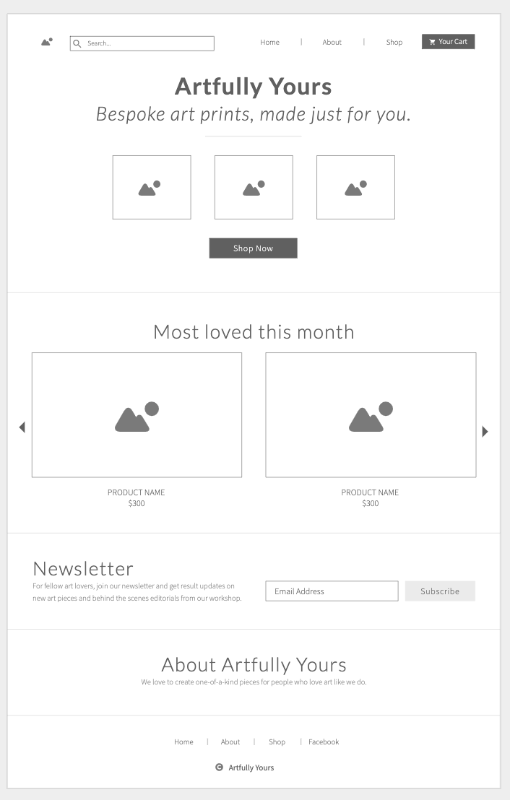
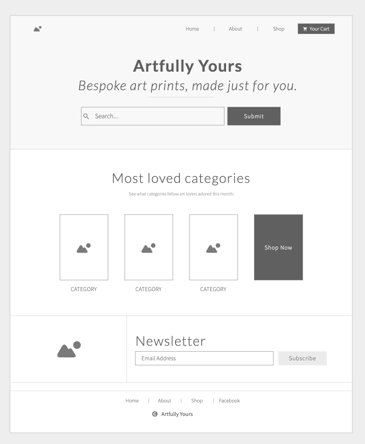
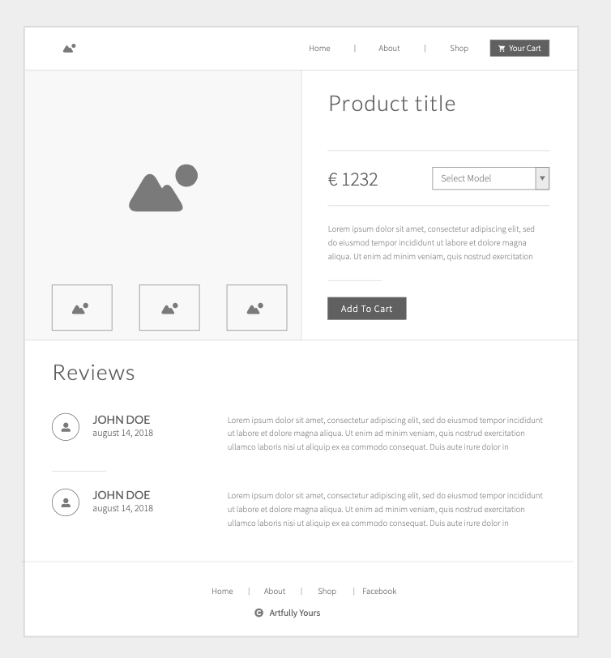
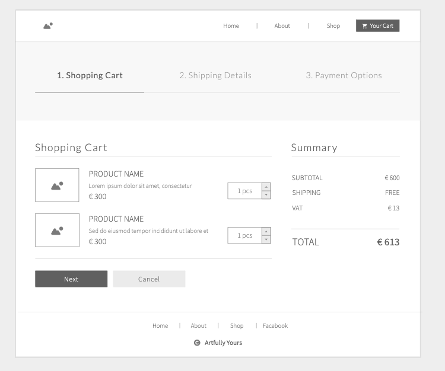
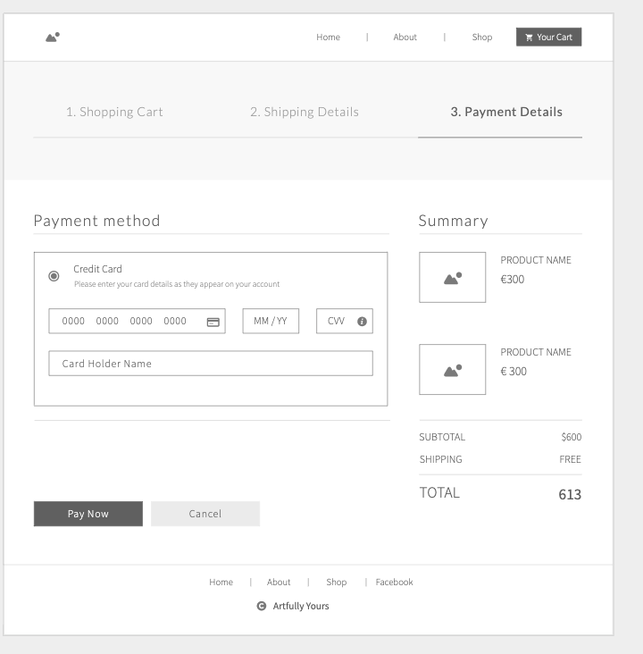

# Artfully Yours

* Response Mockup

## Project Goals

* Create an e-commerce website for the site owner to sell their artwork - display available artwork, showcase sold work, take debit/credit card payments and send out email notificatins. 

### External user’s goal:

* View avaiable art work
* Access to showcase of sold out art work
* Make card payments and receive email confirmation
* Sign up for newsletter

### Site owner's goal:

* Add and remove art work as needed (available to buy)
* Add and remove art work to showcase (sold out)
* View list of orders placed by customers
* Send out newsletter to those who signed up

## UX/UI

### User Stories

* As a site user, I want to view current art products available
* As a site user, I want to view previously (sold out/no longer) available art products
* As a site user, I want nagivate product inventory by category 
* As a site user, I want to pay by debit/credit card so I know payment is made then and there
* As a site user, I want to have an account to securely save personal details (like name and address)
* As a site user, I want to receive email confirmation of payment and order processing

* As a site owner, I want to add new art pieces within categories
* As a site owner, I want to showcase my art products (sold/no longer available)
* As a site owner, I want to be able to view orders placed by customers
* As a site owner, I want to be accept debit/credit card payments 
* As a site owner, I want to utilise SEO, Social Media and Email strategies to market my product
* As a site owner, I want to employ marketing strategies to increase brand reach

### Features

* Feature 1
* Feature 2
* Feature 3

### Wireframes

* Landing Page

* Shopfront Page

* Product Page

* Shopping Cart

* Billing Details

* Payment Details

* Payment Succesful

!

* Customer Account

!

* Site Owner Account

### Database Schema - Entity Relationship Diagram

### Font, Color Scheme and Icons

* Font
* Color Scheme
* Icons

## Deployment

### Deployment

* Step 1
* Step 2

### Heroku  

* Step 1
* Step 2

## SEO and Marketing

### SEO

* Step 1
* Step 2

### Marketing

* Step 1
* Step 2

### Facebook Page

* Step 1
* Step 2

## Credits 

### Code

* Note 1
* Note 2

### Images

* Note 1
* Note 2

### Acknowledgements

* Note 1
* Note 2
